# Scoria Cone Detection in Digital Elevation Models

Computer Vision final project - Federico Cerra S5513839

## 1. Introduction

Scoria (cinder) cones are small volcanoes: conical hills with smooth flanks around
25-35°, usually with a crater on top, and basal diameters between about 200 and 1500 m.
They often form clusters along eruptive fissures. The goal of this project is to find
them automatically in a Digital Elevation Model (DEM).

The approach i tried is a two-stage detector:

1. a proposal stage: a cheap detector that generates many candidate locations. It is
   allowed to produce lots of false positives, its only job is to not miss real cones
   (high recall);
2. a verification stage: a HOG + SVM classifier that looks at each candidate patch and
   decides cone / not cone.

What we detect is the cone itself, meaning the whole conical hill identified by its base
footprint. The crater is a feature that most cones have, and it can help confirm a
detection, but it is not the object we are looking for.

## 2. Datasets

Three volcanic areas, with different label quality, used for different purposes:

| Site | DEM | Labels
|---|---|---
| El Hierro (Canary Islands) | 5 m, 5681x5081 px | 1 shapefile, 196 cones, clean
| Etna (Sicily) | 2 m, 25717x27756 px (2.86 GB) | 2 shapefiles (~230 cones), noisy
| Jeju (South Korea) | 10 m, 7761x4364 px | none

All three DEMs use projected UTM coordinates, so x and y are in meters. Each site falls
in a different UTM zone because they are in different parts of the world.

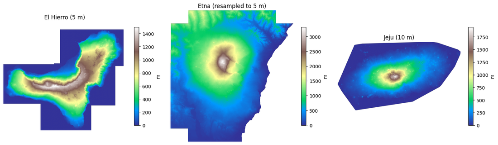

## 3. Data audit

### 3.1 How the El Hierro cones are distributed in the files

 Looking at the attributes in `Cones.shp`, the `coni` field groups the lines into 196 distinct cones, and the `Id` field
says what each line is:

- `Id = 1`: base outline (151 lines). The outer footprint of the cone. This is what we use as ground truth.
- `Id = 2`: crater outline (196 lines). The summit depression.
- `Id = 3`: fissure line (171 lines). This is a direction.

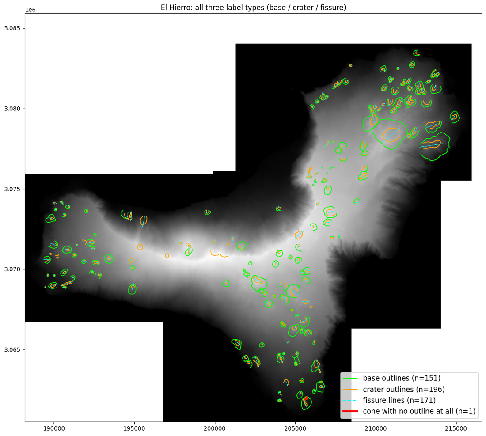

### 3.2 How the Etna cones are distributed in the files

Etna splits the labels by feature type into two shapefiles, instead of mixing everything
in one file like El Hierro:

- `coni_monogenici.shp`: 230 cone footprints as closed polygons.
- `crateri.shp`: 247 crater rims as LineStrings, with only an `Id` column.

### 3.3 The Etna shapefiles have no CRS

Both Etna label files come without a `.prj` file, so geopandas loads them with
`crs=None`. I assigned them the CRS of the DEM (EPSG:32633).

### 3.4 Loading choices for the DEMs

- Etna is downsampled while reading. At 2 m resolution the file is 2.86 GB, too much to
  load and then resample. With rasterio you can pass `out_shape` and average resampling to
  `read()`, and GDAL produces the 5 m version directly, so the full resolution array never
  exists in memory. This also brings Etna to the same resolution as El Hierro, which is
  what the rest of the pipeline expects.
- The three DEMs mark missing data (the sea, mostly) in three different ways: El Hierro
  with a value around -3.4e38, Etna with -9999, Jeju with NaN. At load time everything is
  converted to NaN (checking `isfinite`, a bound `z > -1000` m, and the declared nodata
  value), so the rest of the code only has to deal with one convention.

## 4. Ground truth

### What the ground truth is, and when a detection counts as correct

The ground truth is a list of (center_x, center_y, radius), one row per cone. The mapped
outlines are only used to produce these numbers (mean vertex position = center, mean
vertex distance = radius, on El Hierro; centroid and equivalent-area radius on Etna) and
then never touched again: at evaluation time there are no polygons, only points with a
size attached.

A detection is also just a point (the classifier survivors keep an estimated radius too,
but it is not used for scoring). A detection is counted as correct if its center falls
within a distance of

    max(150 m, 0.75 x cone radius)

from a ground truth center.

### What about craters with no cone?

Splitting the 196 El Hierro cones by which geometry they have:

| category | count | ground truth quality |
|---|---|---|
| base outline present | 150 | good: center and radius measured on the real footprint |
| crater only, no base | 45 | rough: acceptable center, radius estimated as crater x ~2 |
| neither (only a fissure line) | 1 | none: nothing to measure |

I also looked at all 45 crater-only cones as zoomed hillshade crops with the crater ring
drawn on top. It becomes clear why nobody digitized their bases: most are heavily eroded,
half-buried or merged with other cones, and several "crater" rings are actually elongated
arcs or tiny pits (radius 20-30 m) at the limit of what a 5 m DEM can represent.

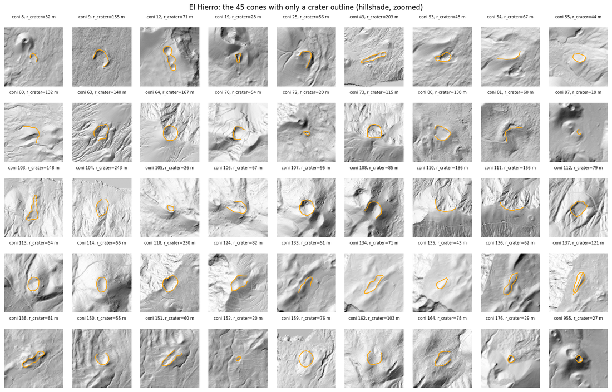

Decision: whether to use these 45 cones as training positives is not obvious, so I treat
it as an experiment instead of deciding up front. The classifier is trained both with and
without them, comparing the results on the validation set. In evaluation they are always
kept. Each ground truth cone gets a quality flag (`has_base`), which makes both training
configurations easy to build. The single cone with no outline at all is excluded.

## 5. Method

### 5.1 Preprocessing

The channel that all later stages use is the detrended elevation: z minus a Gaussian blur
of z with sigma = 500. The blur captures the island-scale trend, the subtraction leaves
cone-scale bumps around 0 (raw elevation goes 0-1500 m on El Hierro, while a cone is a
50-150 m bump, so on raw elevation a blob detector would react to the island, not to the
cones).

The blur has to ignore NaN. `gaussian_filter` does not, so the sea must be filled with
some value first, and the fill leaks into the trend near the data border. So the trend is computed as a
normalized convolution: blur(z with NaN as 0) / blur(valid mask). Border pixels then
average only the valid data and no fill value has to be chosen. Slope (degrees) is also computed
to use it as a classifier feature later.

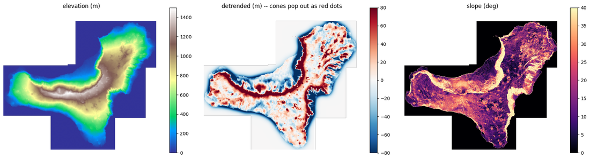

### Which channel does the classifier actually see?

Patches for the classifier are cropped from the detrended layer: raw
elevation carries the regional trend and absolute height, so two identical cones on
different flanks of the island would produce very different patches.

### 5.2 Proposal stage

The first half of the detector generates candidate locations. Precision does not matter
here, only recall: a cone the proposals miss can never be recovered, because the
classifier only ever sees proposed patches. So recall was validated before building
anything else.

Generator: DoG blob detection (`skimage.blob_dog`, difference of Gaussians) on the
positive part of the detrended layer. DoG blurs the
image at a series of growing scales and subtracts consecutive blurs: a round bump shows
up strongest at the scale that matches its size, so every candidate comes with a size
and not just a position (radius = sigma x sqrt(2)). The scale range is set from the cone
radii we expect (30-500 m), the scales grow geometrically (each 1.6x the previous, so
most levels land on the small scales where most cones are), and the threshold is set low
on purpose to over-generate.

Measured on El Hierro (candidates after removing the ones in the sea, recall out of 195
cones with the max(150 m, 0.75 r) rule): 4135 candidates, recall 0.908 (177/195), split
0.933 on the 150 clean cones and 0.822 on the 45 crater-fallback ones.

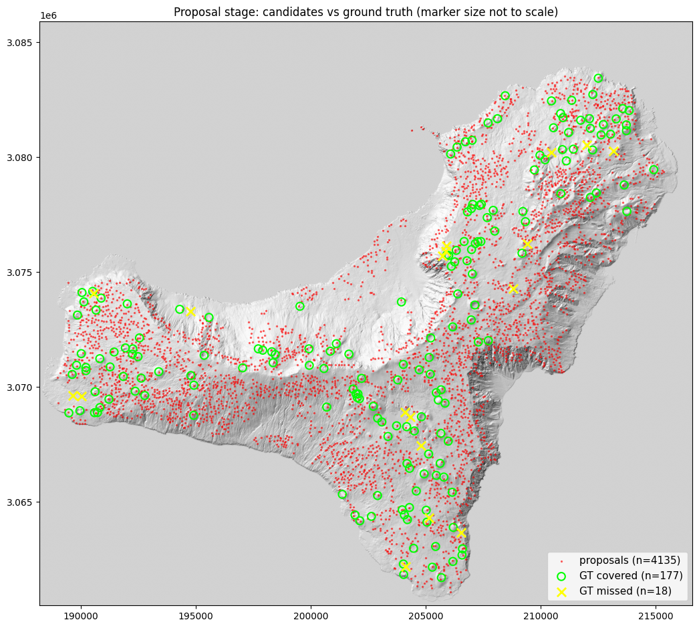

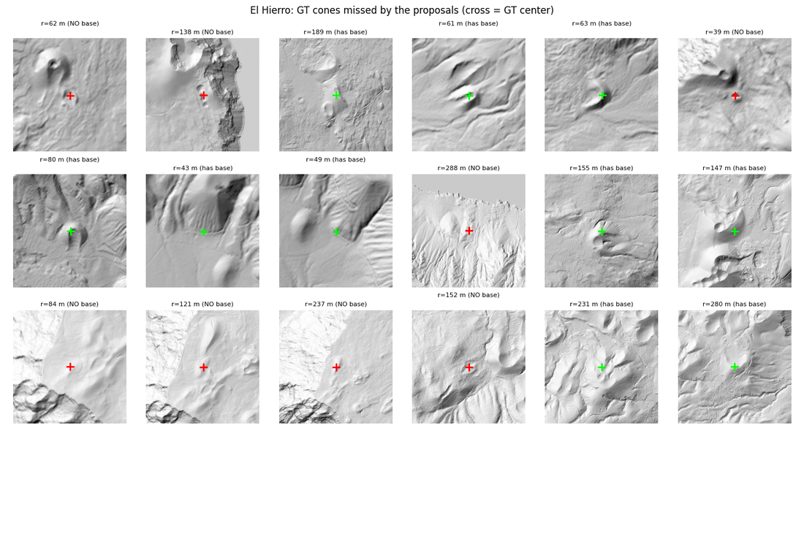

### 5.3 Patch dataset

The classifier judges one small fixed-size image per candidate: a square crop of the
detrended layer, resampled to 64x64, so a small cone and a big cone fill their patch the
same way. The crop side comes from the candidate radius in three steps.

First a correction, because the DoG radius is systematically too small: on the training
cones it is about half the true footprint (median 0.56). The radius = sigma x sqrt(2) rule is calibrated for a flat disk, but a cone
concentrates its height toward the summit, so DoG locks onto the bright core and reports
its width, not the base outline. The radius is therefore multiplied by 2. Then a clamp to
at least 80 m, because the smallest DoG scale (30 m) would still crop a fragment of flank
instead of a cone. Finally the crop side is 2.5 x that radius, so the cone fills about
80% of the patch with a margin of surrounding terrain around it.

The correction is applied at inference only. Doing the same to the training hard
negatives was tested and cancels the gain: reframed at twice the size they lose the fine
texture that makes them recognizable as non-cones.

Negatives are hard negatives: the proposal candidates that do not match any GT cone.
These are exactly the mistakes the classifier has to learn to reject (ridges, knolls,
rough terrain that fooled the blob detector). Random background patches would be too
easy.

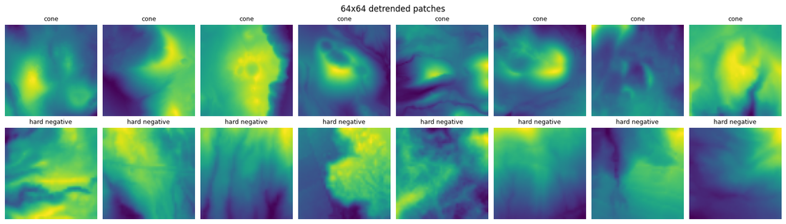

To see how a candidate actually becomes a patch, the figure below takes sixteen covered
cones, sorted from over-framed to under-framed. Top row: the terrain with the true
footprint (green), the DoG detection (red), and the crop window actually used (orange,
side 2.5 x the clamped and corrected radius). Bottom row: the 64x64 patch cut from that
window.

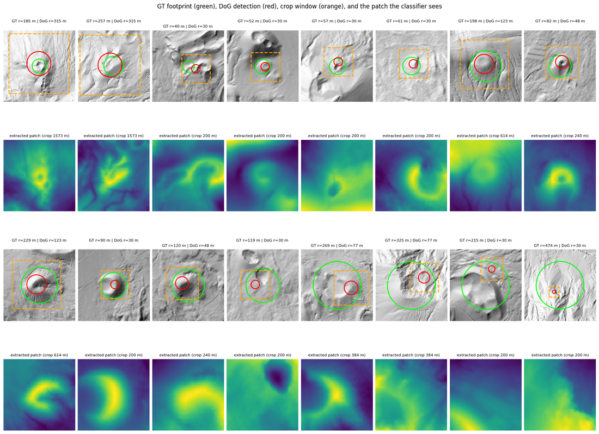

The split into train and validation is 70/30 at the cone level: a random 70% of the
cones (and 70% of the hard negatives) train the classifier, the rest is held out.
Result: train = 136 cones (26 crater-fallback) + 2634 hard negatives, validation =
59 cones (19 crater-fallback) + 1129 hard negatives.

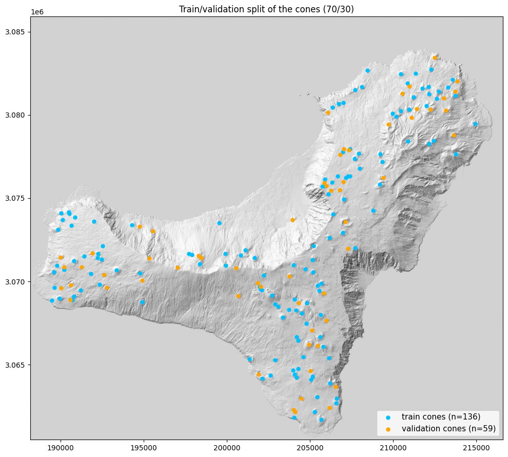

### 5.4 Verification classifier

HOG is applied directly to each 64x64 patch. HOG describes which
way the surface slopes and how strongly in each part of the patch, which fits a cone's
radial flank pattern. The classifier is an RBF SVM with class_weight="balanced", because
the dataset is about 1:18 cones vs hard negatives and an unweighted SVM could just answer
"not cone" every time.

HOG is not rotation invariant but a cone has no preferred orientation, so every training
cone enters 8 times, rotated 0-315°. Each copy also gets a random center shift (up to
30% of the radius) and scale change (15%), because inference patches come from proposal
candidates that are never perfectly centered: training only on perfectly centered
patches would mean training on a distribution that inference never produces.

A note on what is measured, because two evaluations recur from here on.

*Patch level*: every positive is a patch cut on the true GT center and radius, the
best-case framing, scored against the hard-negative patches. It answers whether the
classifier can recognize a cone from a clean picture. It is not the real score.

*Detection level*: the classifier sees the actual DoG candidates, framed off-center and at
the wrong size, and the survivors are matched one-to-one to the cones.

#### Baseline results
Patch-level results on the validation set (59 cones + 1129 hard negatives): precision
0.488, recall 0.678, F1 0.567.

### 5.5 Verifier comparisons at patch level

#### Feature and label ablations

Here adding a slope histogram and training on only the craters that had a clean cone is tried.

| configuration | precision | recall | F1 |
|---|---|---|---|
| HOG, all cones (baseline) | 0.488 | 0.678 | 0.567 |
| HOG + slope, all cones | 0.465 | 0.678 | 0.552 |
| HOG, clean cones | 0.536 | 0.508 | 0.522 |
| HOG + slope, clean cones (chosen) | 0.500 | 0.492 | 0.496 |

Neither idea beats the baseline here: the slope histogram changes little, and training on
the clean cones only trades some recall for a little precision. The chosen mark
anticipates 5.6: the pick is made at detection level, where this ranking flips, and at
patch level the chosen config is actually the weakest of the four.

#### CNN instead of HOG + SVM

A small CNN (3 conv layers + global average pooling, ~25k parameters) on the identical patches, augmentation and split.
Just for a quick comparison.

| verifier | precision | recall | F1 |
|---|---|---|---|
| chosen SVM (HOG + slope, clean cones) | 0.500 | 0.492 | 0.496 |
| CNN, all cones | 0.303 | 0.729 | 0.428 |
| CNN, clean cones | 0.331 | 0.712 | 0.452 |

On El Hierro patches the two approaches are roughly tied.

#### The pixels themselves as features

What if we used directly the detrended pixels?

| configuration | precision | recall | F1 |
|---|---|---|---|
| HOG, all cones (baseline) | 0.488 | 0.678 | 0.567 |
| pixels only | 0.483 | 0.712 | 0.575 |
| HOG + slope + pixels | 0.698 | 0.746 | 0.721 |

At patch level this is the best configuration in the whole project. Section 5.6 shows it
is also the most misleading.

#### Other classifier heads

Same features and training set (HOG + slope, all cones), only the classifier swapped.

| classifier | patch F1 |
|---|---|
| RBF SVM | 0.552 |
| linear SVM | 0.335 |
| logistic regression | 0.330 |
| random forest (500 trees) | 0.479 |
| XGBoost | 0.494 |

### 5.6 The same comparisons at detection level

Now we use the same verifiers on the actual DoG candidates,
framed off-center and at the wrong size, matched one-to-one to the validation cones. The
candidates keep their raw DoG radii here: the radius correction of 5.3 enters only in the
final evaluation, which is why the chosen config scores F1 0.425 in this section but
0.472 in section 6.1.

#### Feature and label ablations

| configuration | precision | recall | F1 | detections |
|---|---|---|---|---|
| HOG, all cones (baseline) | 0.384 | 0.475 | 0.424 | 73 |
| HOG + slope, all cones | 0.364 | 0.475 | 0.412 | 77 |
| HOG, clean cones | 0.449 | 0.373 | 0.407 | 49 |
| HOG + slope, clean cones (chosen) | 0.444 | 0.407 | 0.425 | 54 |

The ranking is different from patch level: the baseline, best on patches, is not the best
detector, and the chosen config has the top detection F1 (0.425), a hair above the baseline
(0.424). The four are within noise (F1 0.407-0.425 on 59 cones).

#### CNN instead of HOG + SVM

| verifier | precision | recall | F1 | detections |
|---|---|---|---|---|
| chosen SVM (HOG + slope, clean cones) | 0.444 | 0.407 | 0.425 | 54 |
| CNN, all cones | 0.176 | 0.373 | 0.239 | 125 |
| CNN, clean cones | 0.189 | 0.339 | 0.242 | 106 |

Tied on patches, the CNN is clearly behind at detection level, about half the SVM's F1.
The gap widens further cross-site on Etna (6.2).

#### The pixels themselves as features

| verifier | precision | recall | F1 | detections |
|---|---|---|---|---|
| HOG, all cones (baseline) | 0.384 | 0.475 | 0.424 | 73 |
| pixels only | 0.167 | 0.153 | 0.159 | 54 |
| HOG + slope + pixels | 0.500 | 0.322 | 0.392 | 38 |

Raw pixels in an RBF kernel are template matching, very
sensitive to misalignment: they work on GT-centered patches, the framing the training
positives have, but real candidates arrive off-center, and pixel similarity dies within a
few pixels of shift.

#### Other classifier heads

| classifier | precision | recall | F1 | detections |
|---|---|---|---|---|
| RBF SVM | 0.364 | 0.475 | 0.412 | 77 |
| linear SVM | 0.152 | 0.525 | 0.236 | 204 |
| logistic regression | 0.153 | 0.525 | 0.237 | 203 |
| random forest (500 trees) | 0.288 | 0.508 | 0.368 | 104 |
| XGBoost | 0.264 | 0.475 | 0.339 | 106 |

The RBF SVM wins here too.

## 6. Results

### 6.1 Final result on El Hierro

| El Hierro validation | precision | recall | F1 | detections |
|---|---|---|---|---|
| proposals only | 0.039 | 0.797 | 0.074 | 1218 |
| + SVM verifier | 0.532 | 0.424 | 0.472 | 47 |
| + CNN verifier | 0.194 | 0.441 | 0.269 | 134 |

The verifier lifts detection precision from 0.039 to 0.532, about 13x
over the raw proposals, while keeping a little under half of the reachable cones (recall
0.424).

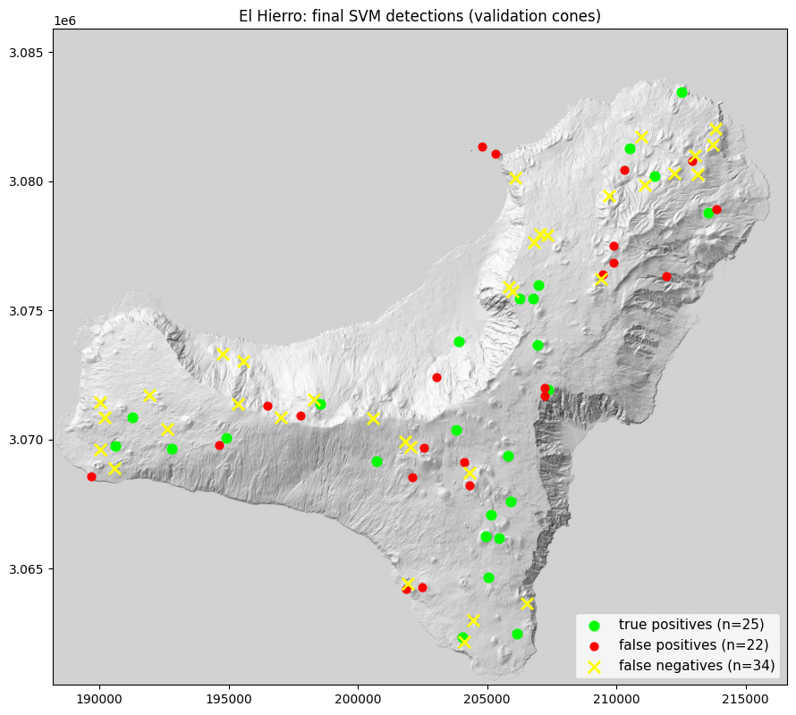

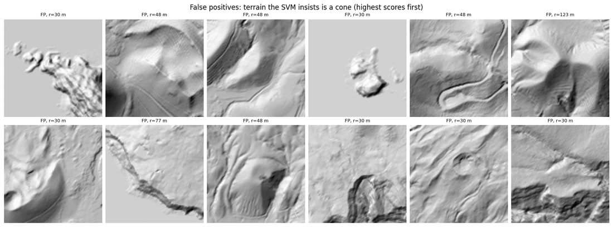

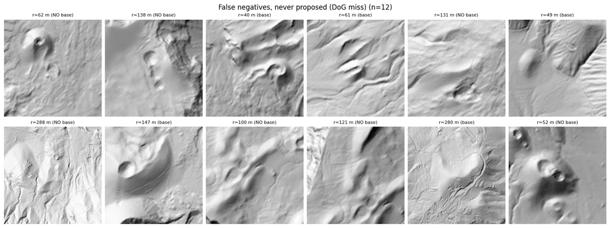

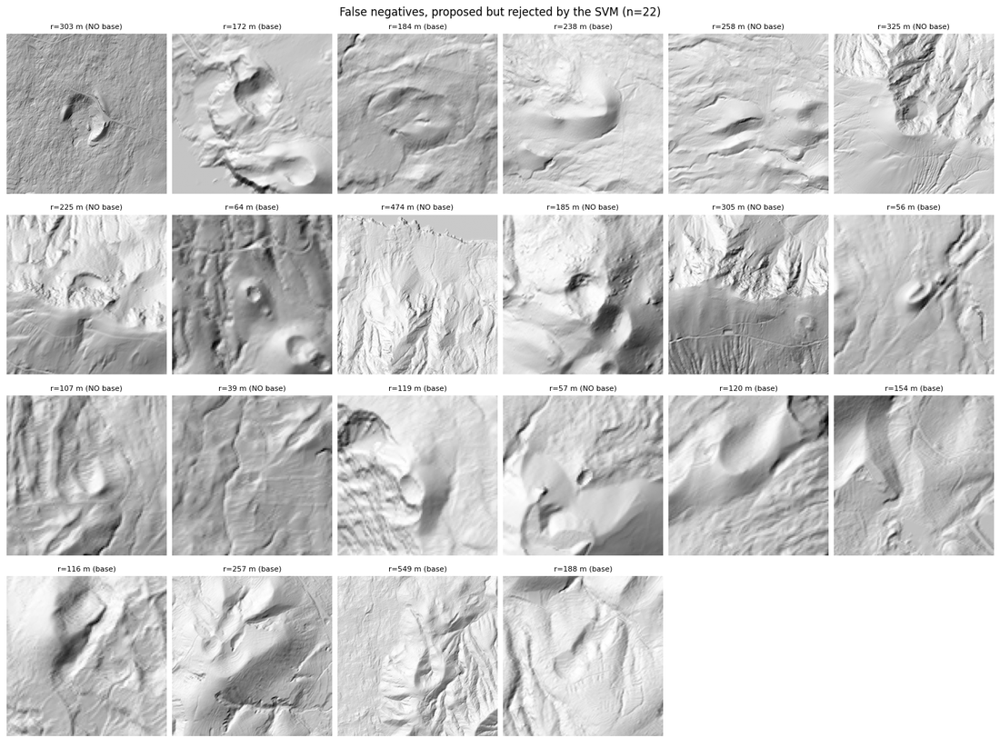

The mistake images say where the remaining errors are. The false positives are mostly
cone-sized knolls and rough mounds, and a few are convincing enough that a person might
flag them too. The lost cones split in two: 12 of the 34 were never proposed at all, too
low or too eroded for the blob detector to react to, and the rest were proposed but
rejected, some because the candidate framed the cone off-center or at the wrong size
and some because its shape was wrong.

### 6.2 Cross-site test on Etna

Both verifiers retrained on all of El Hierro (with the configurations chosen above),
then the unchanged pipeline runs on Etna: 28590 candidates for 230 GT cones, proposal
recall 0.878. Detection-level results, one-to-one matching with the max(150 m, 0.75 r)
rule:

| Etna | precision | recall | F1 | detections |
|---|---|---|---|---|
| proposals only | 0.007 | 0.874 | 0.014 | 28590 |
| + SVM verifier | 0.092 | 0.626 | 0.161 | 1557 |
| + CNN verifier | 0.022 | 0.800 | 0.044 | 8218 |

Etna is a deliberately hard test, because it is a different kind of volcano and its cones
do not look like El Hierro's: they cover a wider range of shapes, sizes and states of
erosion, and they sit in rougher, more cluttered terrain.

The SVM does clearly better than the CNN (F1 0.161 vs 0.044), so the hand-designed features
degrade more gracefully than the
learned ones. But 0.161 is a poor score in absolute terms: precision is only 0.092, so
most of what the SVM accepts is not a mapped cone.  The Etna shapefile is noisy and incomplete,
and many real cones on those flanks are simply not mapped, so some of the unmatched
detections are probably real cones being counted as
false positives. The measured precision is therefore a lower bound, and the true numbers
are somewhat better than the table says.

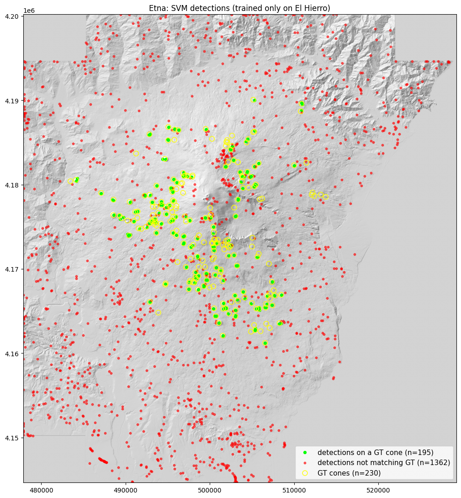

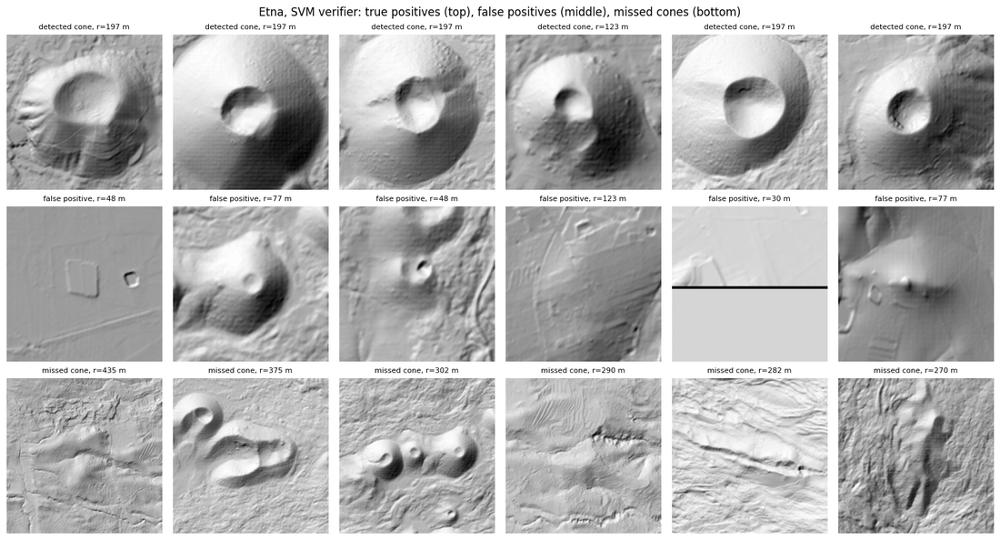

## 7. Conclusions

Are the results good enough? The detector reaches a detection F1 of
about 0.47 on the site it was trained on, and clearly less than that on Etna. In
practice it finds roughly half of the cones and still lets through a fair number of
false positives, so a human would still have to check every map it produces.

I think the main reasons are both the approach and the lack of data. The pipeline
is assembled from hand-designed pieces, a blob detector for the proposals and HOG plus an
SVM for the verification, and each piece carries an assumption that only partly fits the
problem.
A more modern approach would let the model learn these things from the
data instead of hard-coding them.

A few directions look more promising than what I did:

- A single end-to-end object detector, for example a Faster R-CNN
  that replaces both stages at once. It would learn its own proposals and its own features.

- Semantic segmentation with something like a U-Net, labelling every pixel as cone or not
  and then grouping the pixels into instances. This would also fix the biggest weakness of
  my output, that it gives good centers but only rough sizes, because a segmentation
  produces the actual footprint.

- Mask R-CNN combines the two. Its mask branch predicts a per-instance segmentation mask
  rather than the axis-aligned bounding box of Faster R-CNN, so the cone footprint is
  obtained directly. And because instances are resolved before the mask is predicted,
  adjacent cones remain distinct by construction, whereas a semantic map requires
  connected-component grouping and would merge touching footprints into a single region.

These methods though need more labelled data than I had, ideally cones
mapped across several different volcanoes rather than one island.
## 8. Limitations

- Training data. The classifier learned from a single small site: about 150 usable cones
  on one island, all at 5 m resolution. That is very little for a shape as variable as a
  scoria cone, and the cross-site test on Etna shows the cost, the models do not transfer
  well to a different volcano.
- Etna labels. The Etna shapefile is noisy and incomplete, so its numbers are a lower
  bound: some detections counted as false positives are probably real cones that were
  never mapped, which pushes the measured precision down.
- Cones with less than about 20 m of relief are barely visible in a 5 m
  DEM, so the proposal stage cannot find them and its recall is capped around 0.95.
  Nothing the classifier does can recover a cone the proposals miss, so this is a hard
  ceiling on the whole detector.
- A detection is a reliable center but only a rough size. The size
  comes from the DoG scale, which takes a handful of quantized values.
